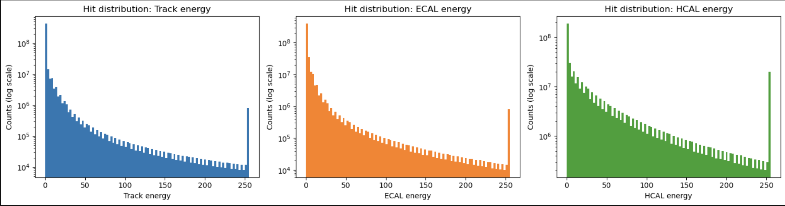
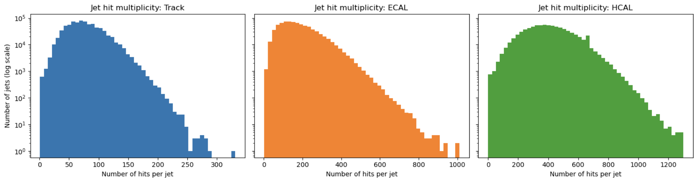
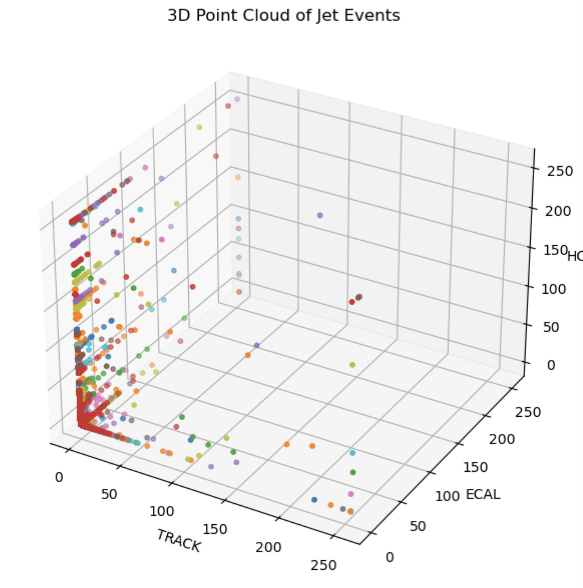
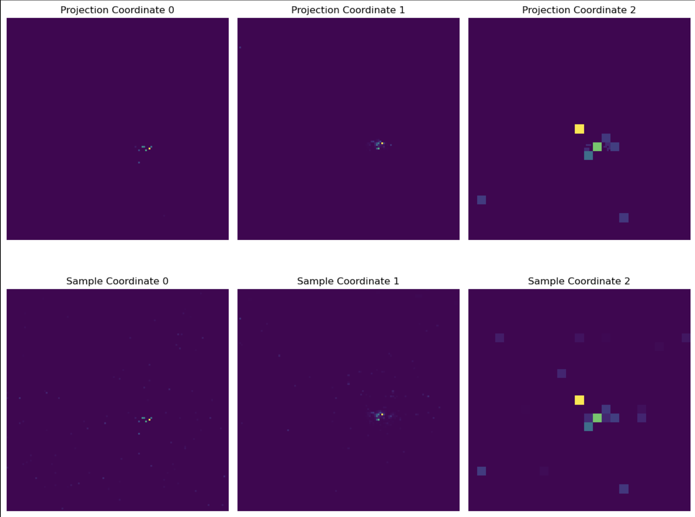

# End-to-End Sparse Point Cloud Jet Classification

## Dataset Preparation

This section describes the data preparation pipeline for the Quark-Gluon (QG) jet classification dataset. The original data is stored in HDF5 format with jet events represented as 3D images (125×125×3), which are transformed into point cloud representations for more efficient processing.

## Initial Data Loading

The dataset is loaded from HDF5 files containing jet events:

```python
import numpy as np
import pandas as pd
import matplotlib.pyplot as plt
import os
import glob
import h5py as h5
from tqdm.auto import tqdm

Data_dir = "/global/cfs/cdirs/m4392/ACAT_Backup/Data/"
Flavor = "QG"
Data_file = h5.File(glob.glob(os.path.join(Data_dir, Flavor) + "/*.h5")[0], "r")
```

## Data Structure

### Original Format
- **Shape**: `(n_jets, 125, 125, 3)`
  - `n_jets`: Number of jet events
  - `125×125`: Spatial dimensions
  - `3`: Feature channels (Track, ECAL, HCAL)

### Data Characteristics
The data is highly sparse. For example, examining a single jet event:
- Total elements: 125 × 125 × 3 = 46,875
- Zero-valued elements: 45,842 (~97.8% sparse)
- Non-zero elements: Only ~1,033 hits

## Transformation to Point Cloud Format

To handle the data sparsity efficiently, we transform the image-based representation into a point cloud format.

### Step 1: Determine Maximum Hits

First, we scan all jets to find the maximum number of non-zero hits across the dataset:

```python
ds = Data_file["train_jet"]
n_jets, H, W, C = ds.shape

max_hits = 0
n_hits_per_jet = []

for i in tqdm(range(n_jets), desc="Finding max hits"):
    sample = ds[i]  # (H, W, C)
    mask = np.sum(sample > 0, axis=-1) > 0
    n_hits = np.sum(mask)
    n_hits_per_jet.append(n_hits)
    if n_hits > max_hits:
        max_hits = n_hits
```

### Step 2: Create Padded Point Cloud Array

Initialize a zero-padded array to store all jets uniformly:

```python
padded_point_clouds = np.zeros((n_jets, max_hits, 3))

for i in tqdm(range(n_jets), desc="Padding jets"):
    sample = ds[i]
    mask = np.sum(sample > 0, axis=-1) > 0
    
    # Extract non-zero hits for each detector channel
    track = sample[:, :, 0][mask]
    ecal = sample[:, :, 1][mask]
    hcal = sample[:, :, 2][mask]
    xyz_hits = np.stack([track, ecal, hcal], axis=1)  # (n_hits, 3)
    
    # Pad to max_hits length
    n_hits = xyz_hits.shape[0]
    padded_point_clouds[i, :n_hits, :] = xyz_hits
```

### Step 3: Save Processed Data

Save the point cloud data and metadata to a new HDF5 file:

```python
with h5.File("jets_data.h5", "w") as f:
    f.create_dataset("point_cloud", data=padded_point_clouds, compression="gzip")
    f.create_dataset("n_hits_per_jet", data=n_hits_per_jet, compression="gzip")
```

## Data Analysis

### Loading Processed Data

```python
with h5.File("jets_data.h5", "r") as f:
    padded_point_clouds = f["point_cloud"][:]  # (N_jets, max_hits, 3)
    n_hits_per_jet = f["n_hits_per_jet"][:]    # (N_jets,)

# Create mask for real hits (exclude padding)
mask = np.zeros(padded_point_clouds.shape[:2], dtype=bool)
for i, n_hits in enumerate(n_hits_per_jet):
    mask[i, :n_hits] = True
```

### Hit Energy Distribution

Analysis of energy deposits across the three detector channels:

```python
# Extract non-padded values for each detector
track = padded_point_clouds[:, :, 0][mask]
ecal = padded_point_clouds[:, :, 1][mask]
hcal = padded_point_clouds[:, :, 2][mask]

# Plot histograms
labels = ["Track energy", "ECAL energy", "HCAL energy"]
fig, axes = plt.subplots(1, 3, figsize=(15, 4))

for dim, vals in enumerate([track, ecal, hcal]):
    axes[dim].hist(vals, bins=100, log=True, color=f'C{dim}')
    axes[dim].set_xlabel(labels[dim])
    axes[dim].set_ylabel("Counts (log scale)")
    axes[dim].set_title(f"Hit distribution: {labels[dim]}")

plt.tight_layout()
plt.show()
```

**Key Observations**:
- Track energy shows exponential decay with highest density at low energies
- ECAL and HCAL follow similar distributions with energy ranges up to ~250 units
- All channels exhibit long tails indicating rare high-energy deposits



### Jet Hit Multiplicity

Analysis of the number of hits per jet in each detector channel:

```python
n_jets = len(n_hits_per_jet)
n_hits_track = np.zeros(n_jets, dtype=int)
n_hits_ecal = np.zeros(n_jets, dtype=int)
n_hits_hcal = np.zeros(n_jets, dtype=int)

for i in range(n_jets):
    hits = padded_point_clouds[i, :n_hits_per_jet[i], :]
    n_hits_track[i] = np.sum(hits[:, 0] > 0)
    n_hits_ecal[i] = np.sum(hits[:, 1] > 0)
    n_hits_hcal[i] = np.sum(hits[:, 2] > 0)
```

**Key Observations**:
- **Track**: Typical range 50-150 hits per jet, with a peak around 100 hits
- **ECAL**: Broader distribution, 100-600 hits, peaking around 200-300 hits
- **HCAL**: Widest distribution, 100-1000 hits, with peak around 400-600 hits
- All distributions show log-normal characteristics



### 3D Point Cloud Visualization

Visualization of jet events in the three-dimensional feature space:

```python
from mpl_toolkits.mplot3d import Axes3D

all_point_cloud = []
for i in tqdm(range(1000)):
    sample = Data_file["train_jet"][i, :, :, :]
    truth_array = sample > 0
    truth_array = np.sum(truth_array, -1) > 0
    
    point_cloud_TRACK = sample[:, :, 0][truth_array]
    point_cloud_ECAL = sample[:, :, 1][truth_array]
    point_cloud_HCAL = sample[:, :, 2][truth_array]
    
    point_cloud = np.concatenate([point_cloud_TRACK[:, None],
                                   point_cloud_ECAL[:, None],
                                   point_cloud_HCAL[:, None]], -1)
    all_point_cloud.append(point_cloud)

# Visualize first 10 jets
fig = plt.figure(figsize=(8, 6))
ax = fig.add_subplot(111, projection='3d')

for i in range(10):
    point_cloud = all_point_cloud[i]
    ax.scatter(point_cloud[:, 0], point_cloud[:, 1], point_cloud[:, 2], 
               marker='o', s=10)

ax.set_xlabel('TRACK')
ax.set_ylabel('ECAL')
ax.set_zlabel('HCAL')
ax.set_title('3D Point Cloud of Jet Events')

plt.tight_layout()
plt.show()
```



## Energy-Based Trimming and Final Dataset Preparation

After initial point cloud conversion, the dataset still contains jets with highly variable numbers of hits (ranging from ~50 to 1800+). To create a uniform input size for neural networks and focus on the most energetic hits, we apply an energy-based trimming strategy.

### Step 1: Determine Maximum Hit Count

First, we scan through all jets to find the maximum number of hits in the entire dataset:

```python
max_hit = 0
for i in tqdm(range(0, Data_file["train_jet"].shape[0]//nevents + 1, 1)):
    x = Data_file["train_jet"][i*nevents:(i+1)*nevents, :]
    mask = np.sum((x > 0), axis=-1) > 0
    nhits = np.sum(mask, (1, 2))
    if nhits.max() > max_hit:
        max_hit = nhits.max()
```

**Result**: `max_hit = 1825` hits in the most complex jet event.

### Step 2: Apply Energy Trimming

Rather than keeping all 1825 hits (which would be computationally expensive and include many low-energy noise hits), we trim each jet to keep only the top 200 most energetic hits:

```python
TrimPoints = 200
X = []
Y = []

for i in tqdm(range(Total_num_events)):
    x = Data_file["train_jet"][i, :]
    x = get_point_clouds(x)  # Convert to point cloud
    x = trim(x, CUT_POINTS=TrimPoints)  # Keep top 200 energetic hits
    y = Data_file["test_meta"][i, 2]  # Get label
    X.append(x[None, :, :])
    Y.append(y)

X_ = np.concatenate(X, 0)
Y_ = np.array(Y)
```

**Output Shape**: `(793900, 200, 5)`
- 793,900 jet events
- 200 hits per jet (trimmed)
- 5 features per hit: [Track, ECAL, HCAL, X_coordinate, Y_coordinate]

### Why Trim to 200 Points?

1. **Focus on Signal**: High-energy hits contain the most discriminative physics information
2. **Noise Reduction**: Low-energy hits are often detector noise or soft radiation

### Step 3: Visualization - Comparing Original vs Trimmed Data

To verify that trimming preserves the essential jet structure, we reconstruct the spatial projections:

```python
sample_idx = 2
sample = Data_file["train_jet"][sample_idx, :]
trimmed_point_cloud = X_[sample_idx]

# Reconstruct projection from trimmed point cloud
projection = np.zeros((125, 125, 3))
for i in range(trimmed_point_cloud.shape[0]):
    x = trimmed_point_cloud[i, -1]  # X coordinate
    y = trimmed_point_cloud[i, -2]  # Y coordinate
    projection[int(x), int(y), :] = trimmed_point_cloud[i, 0:3]  # [Track, ECAL, HCAL]

# Visualize original vs trimmed
fig, axes = plt.subplots(2, 3, figsize=(12, 10))
for i in range(3):
    axes[0, i].imshow(projection[:, :, i])
    axes[0, i].set_title(f'Projection Coordinate {i}')
    axes[0, i].axis('off')
    axes[1, i].imshow(sample[:, :, i])
    axes[1, i].set_title(f'Sample Coordinate {i}')
    axes[1, i].axis('off')
plt.tight_layout()
plt.show()
```

