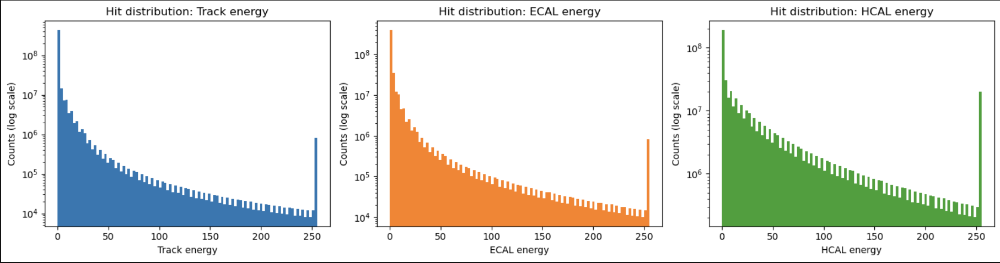
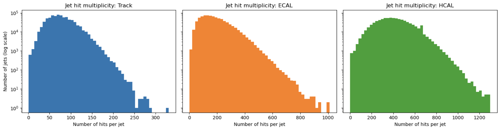
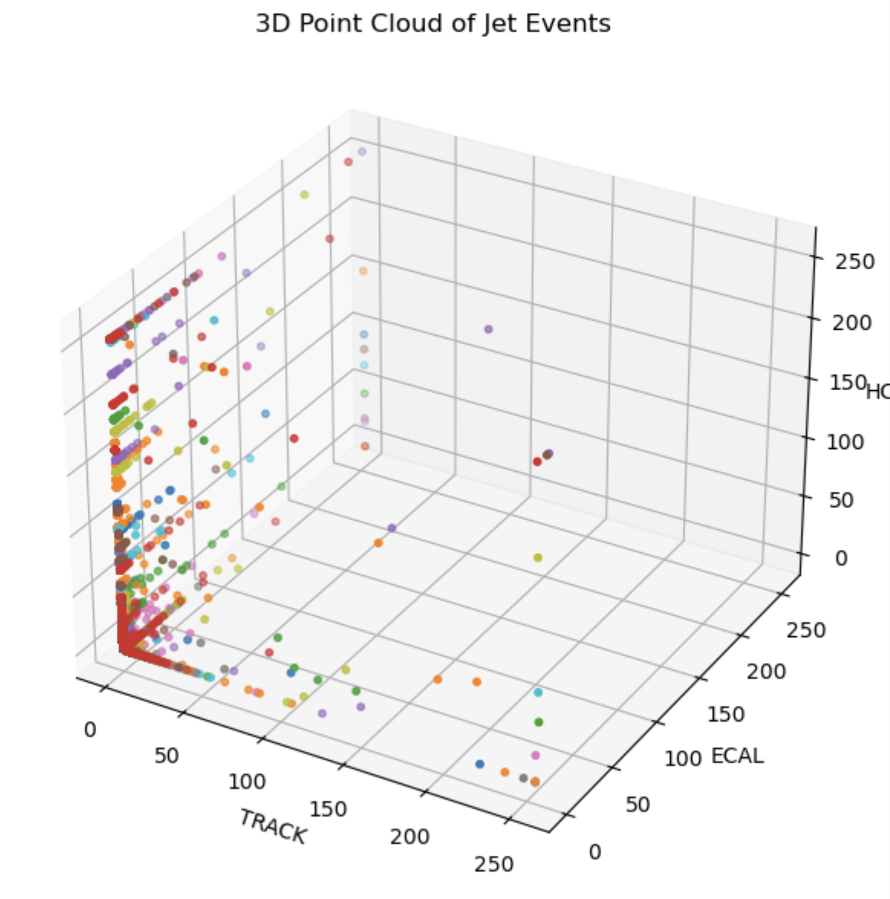
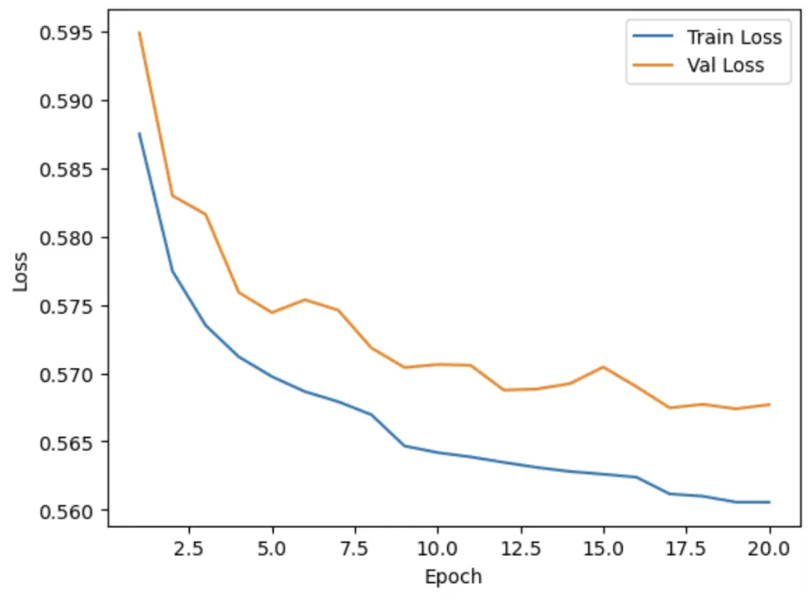
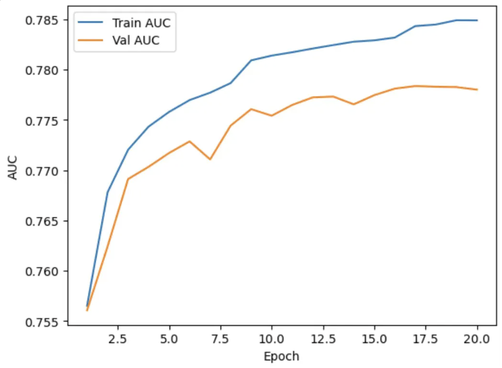
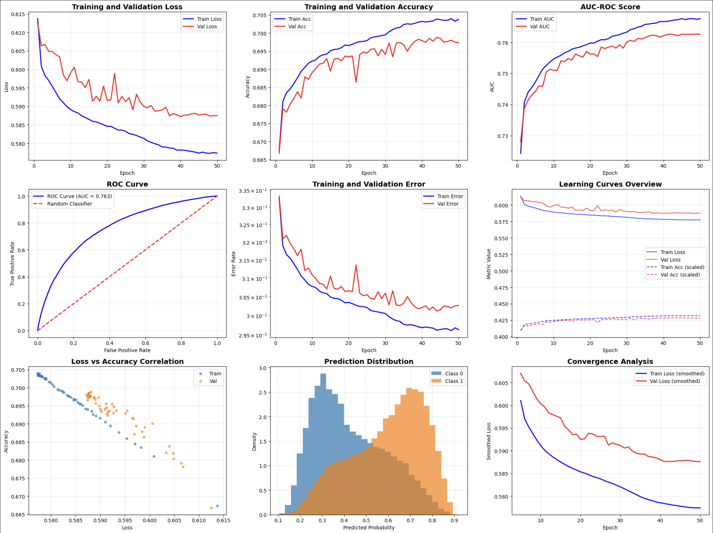
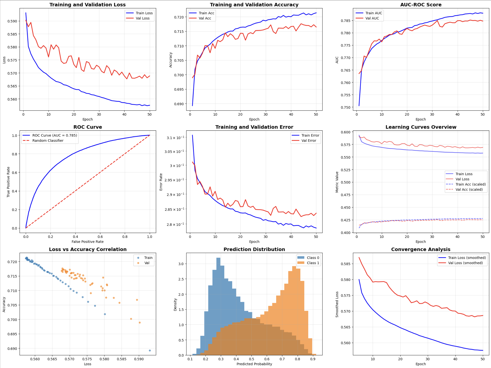

# End-to-End Sparse Point Cloud Jet Classification

## Dataset Preparation

This section describes the data preparation pipeline for the Quark-Gluon (QG) jet classification dataset. The original data is stored in HDF5 format with jet events represented as 3D images (125×125×3), which are transformed into point cloud representations for more efficient processing.

## Initial Data Loading

The dataset is loaded from HDF5 files containing jet events:

```python
import numpy as np
import pandas as pd
import matplotlib.pyplot as plt
import os
import glob
import h5py as h5
from tqdm.auto import tqdm

Data_dir = "/global/cfs/cdirs/m4392/ACAT_Backup/Data/"
Flavor = "QG"
Data_file = h5.File(glob.glob(os.path.join(Data_dir, Flavor) + "/*.h5")[0], "r")
```

## Data Structure

### Original Format
- **Shape**: `(n_jets, 125, 125, 3)`
  - `n_jets`: Number of jet events
  - `125×125`: Spatial dimensions
  - `3`: Feature channels (Track, ECAL, HCAL)

### Data Characteristics
The data is highly sparse. For example, examining a single jet event:
- Total elements: 125 × 125 × 3 = 46,875
- Zero-valued elements: 45,842 (~97.8% sparse)
- Non-zero elements: Only ~1,033 hits

## Transformation to Point Cloud Format

To handle the data sparsity efficiently, we transform the image-based representation into a point cloud format.

### Step 1: Determine Maximum Hits

First, we scan all jets to find the maximum number of non-zero hits across the dataset:

```python
ds = Data_file["train_jet"]
n_jets, H, W, C = ds.shape

max_hits = 0
n_hits_per_jet = []

for i in tqdm(range(n_jets), desc="Finding max hits"):
    sample = ds[i]  # (H, W, C)
    mask = np.sum(sample > 0, axis=-1) > 0
    n_hits = np.sum(mask)
    n_hits_per_jet.append(n_hits)
    if n_hits > max_hits:
        max_hits = n_hits
```

### Step 2: Create Padded Point Cloud Array

Initialize a zero-padded array to store all jets uniformly:

```python
padded_point_clouds = np.zeros((n_jets, max_hits, 3))

for i in tqdm(range(n_jets), desc="Padding jets"):
    sample = ds[i]
    mask = np.sum(sample > 0, axis=-1) > 0
    
    # Extract non-zero hits for each detector channel
    track = sample[:, :, 0][mask]
    ecal = sample[:, :, 1][mask]
    hcal = sample[:, :, 2][mask]
    xyz_hits = np.stack([track, ecal, hcal], axis=1)  # (n_hits, 3)
    
    # Pad to max_hits length
    n_hits = xyz_hits.shape[0]
    padded_point_clouds[i, :n_hits, :] = xyz_hits
```

### Step 3: Save Processed Data

Save the point cloud data and metadata to a new HDF5 file:

```python
with h5.File("jets_data.h5", "w") as f:
    f.create_dataset("point_cloud", data=padded_point_clouds, compression="gzip")
    f.create_dataset("n_hits_per_jet", data=n_hits_per_jet, compression="gzip")
```

## Data Analysis

### Loading Processed Data

```python
with h5.File("jets_data.h5", "r") as f:
    padded_point_clouds = f["point_cloud"][:]  # (N_jets, max_hits, 3)
    n_hits_per_jet = f["n_hits_per_jet"][:]    # (N_jets,)

# Create mask for real hits (exclude padding)
mask = np.zeros(padded_point_clouds.shape[:2], dtype=bool)
for i, n_hits in enumerate(n_hits_per_jet):
    mask[i, :n_hits] = True
```

### Hit Energy Distribution

Analysis of energy deposits across the three detector channels:

```python
# Extract non-padded values for each detector
track = padded_point_clouds[:, :, 0][mask]
ecal = padded_point_clouds[:, :, 1][mask]
hcal = padded_point_clouds[:, :, 2][mask]

# Plot histograms
labels = ["Track energy", "ECAL energy", "HCAL energy"]
fig, axes = plt.subplots(1, 3, figsize=(15, 4))

for dim, vals in enumerate([track, ecal, hcal]):
    axes[dim].hist(vals, bins=100, log=True, color=f'C{dim}')
    axes[dim].set_xlabel(labels[dim])
    axes[dim].set_ylabel("Counts (log scale)")
    axes[dim].set_title(f"Hit distribution: {labels[dim]}")

plt.tight_layout()
plt.show()
```

**Key Observations**:
- Track energy shows exponential decay with highest density at low energies
- ECAL and HCAL follow similar distributions with energy ranges up to ~250 units
- All channels exhibit long tails indicating rare high-energy deposits



### Jet Hit Multiplicity

Analysis of the number of hits per jet in each detector channel:

```python
n_jets = len(n_hits_per_jet)
n_hits_track = np.zeros(n_jets, dtype=int)
n_hits_ecal = np.zeros(n_jets, dtype=int)
n_hits_hcal = np.zeros(n_jets, dtype=int)

for i in range(n_jets):
    hits = padded_point_clouds[i, :n_hits_per_jet[i], :]
    n_hits_track[i] = np.sum(hits[:, 0] > 0)
    n_hits_ecal[i] = np.sum(hits[:, 1] > 0)
    n_hits_hcal[i] = np.sum(hits[:, 2] > 0)
```

**Key Observations**:
- **Track**: Typical range 50-150 hits per jet, with a peak around 100 hits
- **ECAL**: Broader distribution, 100-600 hits, peaking around 200-300 hits
- **HCAL**: Widest distribution, 100-1000 hits, with peak around 400-600 hits
- All distributions show log-normal characteristics



### 3D Point Cloud Visualization

Visualization of jet events in the three-dimensional feature space:

```python
from mpl_toolkits.mplot3d import Axes3D

all_point_cloud = []
for i in tqdm(range(1000)):
    sample = Data_file["train_jet"][i, :, :, :]
    truth_array = sample > 0
    truth_array = np.sum(truth_array, -1) > 0
    
    point_cloud_TRACK = sample[:, :, 0][truth_array]
    point_cloud_ECAL = sample[:, :, 1][truth_array]
    point_cloud_HCAL = sample[:, :, 2][truth_array]
    
    point_cloud = np.concatenate([point_cloud_TRACK[:, None],
                                   point_cloud_ECAL[:, None],
                                   point_cloud_HCAL[:, None]], -1)
    all_point_cloud.append(point_cloud)

# Visualize first 10 jets
fig = plt.figure(figsize=(8, 6))
ax = fig.add_subplot(111, projection='3d')

for i in range(10):
    point_cloud = all_point_cloud[i]
    ax.scatter(point_cloud[:, 0], point_cloud[:, 1], point_cloud[:, 2], 
               marker='o', s=10)

ax.set_xlabel('TRACK')
ax.set_ylabel('ECAL')
ax.set_zlabel('HCAL')
ax.set_title('3D Point Cloud of Jet Events')

plt.tight_layout()
plt.show()
```



## Energy-Based Trimming and Final Dataset Preparation

After initial point cloud conversion, the dataset still contains jets with highly variable numbers of hits (ranging from ~50 to 1800+). To create a uniform input size for neural networks and focus on the most energetic hits, we apply an energy-based trimming strategy.

### Step 1: Determine Maximum Hit Count

First, we scan through all jets to find the maximum number of hits in the entire dataset:

```python
max_hit = 0
for i in tqdm(range(0, Data_file["train_jet"].shape[0]//nevents + 1, 1)):
    x = Data_file["train_jet"][i*nevents:(i+1)*nevents, :]
    mask = np.sum((x > 0), axis=-1) > 0
    nhits = np.sum(mask, (1, 2))
    if nhits.max() > max_hit:
        max_hit = nhits.max()
```

**Result**: `max_hit = 1825` hits in the most complex jet event.

### Step 2: Apply Energy Trimming

Rather than keeping all 1825 hits (which would be computationally expensive and include many low-energy noise hits), we trim each jet to keep only the top 200 most energetic hits:

```python
TrimPoints = 200
X = []
Y = []

for i in tqdm(range(Total_num_events)):
    x = Data_file["train_jet"][i, :]
    x = get_point_clouds(x)  # Convert to point cloud
    x = trim(x, CUT_POINTS=TrimPoints)  # Keep top 200 energetic hits
    y = Data_file["test_meta"][i, 2]  # Get label
    X.append(x[None, :, :])
    Y.append(y)

X_ = np.concatenate(X, 0)
Y_ = np.array(Y)
```

**Output Shape**: `(793900, 200, 5)`
- 793,900 jet events
- 200 hits per jet (trimmed)
- 5 features per hit: [Track, ECAL, HCAL, X_coordinate, Y_coordinate]

### Why Trim to 200 Points?

1. **Focus on Signal**: High-energy hits contain the most discriminative physics information
2. **Noise Reduction**: Low-energy hits are often detector noise or soft radiation

### Step 3: Visualization - Comparing Original vs Trimmed Data

To verify that trimming preserves the essential jet structure, we reconstruct the spatial projections:

```python
sample_idx = 2
sample = Data_file["train_jet"][sample_idx, :]
trimmed_point_cloud = X_[sample_idx]

# Reconstruct projection from trimmed point cloud
projection = np.zeros((125, 125, 3))
for i in range(trimmed_point_cloud.shape[0]):
    x = trimmed_point_cloud[i, -1]  # X coordinate
    y = trimmed_point_cloud[i, -2]  # Y coordinate
    projection[int(x), int(y), :] = trimmed_point_cloud[i, 0:3]  # [Track, ECAL, HCAL]

# Visualize original vs trimmed
fig, axes = plt.subplots(2, 3, figsize=(12, 10))
for i in range(3):
    axes[0, i].imshow(projection[:, :, i])
    axes[0, i].set_title(f'Projection Coordinate {i}')
    axes[0, i].axis('off')
    axes[1, i].imshow(sample[:, :, i])
    axes[1, i].set_title(f'Sample Coordinate {i}')
    axes[1, i].axis('off')
plt.tight_layout()
plt.show()
```


___

# MLP Classifier for Point Cloud Classification

## Model Architecture

The MLP (Multi-Layer Perceptron) Classifier is designed to process point cloud data through a two-stage architecture: per-point feature extraction followed by global aggregation and classification.

### Architecture Diagram


### Details

**1. Per-Point MLP**
- Processes each point independently through shared weights
- Architecture: 5 → 64 → 128 → 256 → 128 → 64
- Each layer followed by BatchNorm1d and ReLU activation
- Extracts local geometric features from each point

**2. Global Pooling**
- Aggregates per-point features into a single global descriptor
- Pooling method: Mean pooling (configurable to max or sum)
- Reduces dimensionality from (B × N × 64) to (B × 64)

**3. Classification Head**
- Global feature → 64 → 32 → 2 (binary classification)
- Final linear layer outputs logits for 2 classes
- BatchNorm and ReLU between hidden layers

## Training Configuration

### Hyperparameters

| Parameter | Value |
|-----------|-------|
| **Learning Rate** | 1e-3 (0.001) |
| **Optimizer** | Adam |
| **Batch Size** | 256 |
| **Epochs** | 20 |
| **Loss Function** | CrossEntropyLoss |
| **LR Scheduler** | StepLR (step_size=8, gamma=0.5) |
| **Mixed Precision** | Enabled (AMP) |
| **Device** | CUDA (GPU) |


## Training Results

### Performance Metrics

**Final Performance (Epoch 20):**
- **Training Loss:** 0.5606
- **Validation Loss:** 0.5677
- **Training AUC:** 0.7849
- **Validation AUC:** 0.7780
- **Validation Accuracy:** 71.38%

### Training Progression

| Epoch | Train Loss | Val Loss | Train AUC | Val AUC | Val Accuracy |
|-------|-----------|----------|-----------|---------|--------------|
| 1 | 0.5875 | 0.5949 | 0.7565 | 0.7561 | 68.74% |
| 5 | 0.5697 | 0.5744 | 0.7758 | 0.7717 | 70.97% |
| 10 | 0.5642 | 0.5706 | 0.7814 | 0.7754 | 71.34% |
| 15 | 0.5626 | 0.5704 | 0.7829 | 0.7774 | 71.33% |
| 20 | 0.5606 | 0.5677 | 0.7849 | 0.7780 | 71.38% |





**Generalization:**
- Minimal overfitting observed
- Validation metrics closely track training metrics
- Stable validation performance after epoch 12 suggests convergence


**Model Characteristics:**
- Simple and efficient architecture
- Good generalization with minimal overfitting
- Fast inference due to straightforward design
- Permutation invariant to point ordering (via global pooling)

___
# Sparse CNN for Point Cloud Classification (200 Energy Levels)

## Model Architecture

The Sparse Convolutional Neural Network employs depthwise separable convolutions to efficiently process point cloud data with 200 energy levels and 5 features per point. The architecture uses a hierarchical feature extraction approach with progressive spatial downsampling.

### Architecture Diagram



```mermaid
graph TD
    A[Input Point Cloud<br/>B × 200 × 5] --> B[Transpose<br/>B × 5 × 200]
    B --> C[Block 1: 5→16]
    
    C --> C1[Depthwise Conv 3×1<br/>groups=5]
    C1 --> C2[Pointwise Conv 1×1<br/>5→16]
    C2 --> C3[BatchNorm + ReLU]
    C3 --> C4[MaxPool ÷2<br/>200→100]
    C4 --> C5[Depthwise Conv 3×1<br/>groups=16]
    C5 --> C6[Pointwise Conv 1×1<br/>16→16]
    C6 --> C7[BatchNorm + ReLU]
    C7 --> C8[AdaptiveAvgPool<br/>→128]
    
    C8 --> D[Block 2: 16→32]
    D --> D1[Depthwise Conv + Pointwise<br/>16→32]
    D1 --> D2[BatchNorm + ReLU]
    D2 --> D3[MaxPool ÷2<br/>128→64]
    D3 --> D4[Dropout 0.1]
    
    D4 --> E[Block 3: 32→64]
    E --> E1[Depthwise Conv + Pointwise<br/>32→64]
    E1 --> E2[BatchNorm + ReLU]
    E2 --> E3[MaxPool ÷2<br/>64→32]
    E3 --> E4[Dropout 0.1]
    
    E4 --> F[Block 4: 64→128]
    F --> F1[Depthwise Conv + Pointwise<br/>64→128]
    F1 --> F2[BatchNorm + ReLU]
    F2 --> F3[MaxPool ÷2<br/>32→16]
    F3 --> F4[Dropout 0.2]
    
    F4 --> G[Block 5: 128→256]
    G --> G1[Depthwise Conv + Pointwise<br/>128→256]
    G1 --> G2[BatchNorm + ReLU]
    G2 --> G3[MaxPool ÷2<br/>16→8]
    G3 --> G4[Dropout 0.2]
    
    G4 --> H[Global Max Pool<br/>8→1]
    H --> I[B × 256]
    
    I --> J[Classifier]
    J --> J1[Linear 256→128]
    J1 --> J2[ReLU]
    J2 --> J3[Dropout 0.3]
    J3 --> J4[Linear 128→2]
    J4 --> K[Output Logits<br/>B × 2]
    
    style A fill:#e1f5ff
    style H fill:#fff4e1
    style K fill:#e8f5e9
```

### Depthwise Separable Convolution Pattern

Each convolutional block uses depthwise separable convolutions, which factorize a standard convolution into:

1. **Depthwise Convolution**: Applies a single filter per input channel (groups=in_channels)
2. **Pointwise Convolution**: 1×1 convolution to combine channel outputs

This reduces parameters significantly: Standard conv parameters ≈ k×C_in×C_out, Depthwise separable ≈ k×C_in + C_in×C_out

### Component Details

**Block 1 (Input Processing)**
- Depthwise: 5 groups, kernel=3, padding=1
- Pointwise: 5 → 16 channels
- MaxPool: 200 → 100 points
- Second depthwise-pointwise pair (16 → 16)
- AdaptiveAvgPool: Ensures 128 points output

**Blocks 2-5 (Hierarchical Feature Extraction)**
- Progressive channel expansion: 16 → 32 → 64 → 128 → 256
- Spatial dimension reduction: 128 → 64 → 32 → 16 → 8
- Increasing dropout: 0.1 → 0.1 → 0.2 → 0.2

**Global Aggregation & Classification**
- Global Max Pooling: Extracts most salient features
- Two-layer MLP: 256 → 128 → 2
- Final dropout: 0.3 for regularization

## Training Configuration

### Hyperparameters

| Parameter | Value |
|-----------|-------|
| **Learning Rate (Initial)** | 2e-4 (0.0002) |
| **Optimizer** | Adam with weight_decay=1e-4 |
| **Batch Size** | 128 |
| **Epochs** | 50 |
| **Loss Function** | CrossEntropyLoss |
| **LR Scheduler** | CosineAnnealingLR (T_max=50) |
| **Total Parameters** | 79,590 |
| **Device** | CUDA (GPU) |

### Learning Rate Schedule

Cosine annealing provides smooth learning rate decay:
- Starts at 2e-4 and gradually decreases
- Follows cosine curve: η_t = η_min + (η_max - η_min) × (1 + cos(πt/T)) / 2
- No restarts (T_max = num_epochs)

**Learning Rate Progression:**
- Epoch 1: 0.000200
- Epoch 10: 0.000181
- Epoch 25: 0.000100
- Epoch 37: 0.000032
- Epoch 50: ~0.000000

## Training Results

### Dataset Information

- **Training samples:** 793,900 (6,202 batches of 128)
- **Validation samples:** 55,494 (434 batches of 128)
- **Input shape:** (batch, 200 points, 5 features)
- **Task:** Binary classification (signal vs background)

### Final Performance (Epoch 50)

| Metric | Training | Validation |
|--------|----------|------------|
| **Loss** | 0.5773 | 0.5875 |
| **Accuracy** | 70.37% | 69.74% |
| **AUC-ROC** | 0.7676 | **0.7626** |

### Training Progression

| Epoch | Train Loss | Val Loss | Train Acc | Val Acc | Train AUC | Val AUC | LR |
|-------|-----------|----------|-----------|---------|-----------|---------|-----|
| 1 | 0.6137 | 0.6125 | 66.74% | 66.68% | 0.7244 | 0.7280 | 0.000200 |
| 10 | 0.5891 | 0.5990 | 69.22% | 68.91% | 0.7546 | 0.7510 | 0.000181 |
| 20 | 0.5846 | 0.5916 | 69.66% | 69.34% | 0.7598 | 0.7562 | 0.000131 |
| 30 | 0.5813 | 0.5900 | 69.95% | 69.41% | 0.7633 | 0.7601 | 0.000069 |
| 40 | 0.5782 | 0.5872 | 70.32% | 69.79% | 0.7667 | 0.7621 | 0.000019 |
| 50 | 0.5773 | 0.5875 | 70.37% | 69.74% | 0.7676 | **0.7626** | ~0.000000 |

### Key Observations

**Loss Convergence**
- Training loss decreased from 0.6137 to 0.5773 (5.9% reduction)
- Validation loss decreased from 0.6125 to 0.5875 (4.1% reduction)
- Smooth, monotonic convergence with minimal oscillations
- Small train-val gap (0.0102) indicates excellent generalization

**Model Performance**
- Training AUC improved from 0.7244 to 0.7676 (+5.96%)
- Validation AUC improved from 0.7280 to 0.7626 (+4.75%)
- **Best validation AUC: 0.7626** (achieved at epochs 42-50)
- Consistent performance plateau after epoch 37

**Generalization Characteristics**
- Minimal overfitting: Train-Val AUC gap = 0.0050
- Dropout regularization (0.1-0.3) effectively prevents overfitting

**Learning Dynamics**
- Rapid initial improvement (epochs 1-15)
- Steady refinement phase (epochs 15-35)
- Convergence plateau (epochs 35-50)
- Cosine annealing enables fine-tuning in later epochs

## Comparison with MLP Classifier

| Metric | MLP Classifier | Sparse CNN | Difference |
|--------|---------------|------------|------------|
| **Parameters** | ~173K | 79.6K | -54% (CNN) |
| **Best Val AUC** | 0.7780 | 0.7626 | -0.0154 |
| **Val Accuracy** | 71.38% | 69.74% | -1.64% |
| **Train-Val AUC Gap** | 0.0069 | 0.0050 | Better (CNN) |
| **Epochs** | 20 | 50 | |
| **Batch Size** | 256 | 128 | |



---

# Sparse CNN for Point Cloud Classification (800 Energy Levels)

## Model Architecture

The Sparse Convolutional Neural Network for 800 energy levels employs an extended depthwise separable convolution architecture to efficiently process larger point cloud data. The model uses 7 convolutional blocks with progressive spatial downsampling and channel expansion to handle the increased input complexity.

### Architecture Diagram



```mermaid
graph TD
    A[Input Point Cloud<br/>B × 800 × 5] --> B[Transpose<br/>B × 5 × 800]
    B --> C[Block 1: 5→16]
    
    C --> C1[Depthwise Conv 3×1<br/>groups=5]
    C1 --> C2[Pointwise Conv 1×1<br/>5→16]
    C2 --> C3[BatchNorm + ReLU]
    C3 --> C4[Depthwise Conv 3×1<br/>groups=16]
    C4 --> C5[Pointwise Conv 1×1<br/>16→16]
    C5 --> C6[BatchNorm + ReLU]
    C6 --> C7[AdaptiveAvgPool<br/>800→512]
    C7 --> C8[Dropout 0.05]
    
    C8 --> D[Block 2: 16→32]
    D --> D1[Depthwise Conv + Pointwise<br/>16→32]
    D1 --> D2[BatchNorm + ReLU]
    D2 --> D3[MaxPool ÷2<br/>512→256]
    D3 --> D4[Dropout 0.1]
    
    D4 --> E[Block 3: 32→64]
    E --> E1[Depthwise Conv + Pointwise<br/>32→64]
    E1 --> E2[BatchNorm + ReLU]
    E2 --> E3[MaxPool ÷2<br/>256→128]
    E3 --> E4[Dropout 0.1]
    
    E4 --> F[Block 4: 64→128]
    F --> F1[Depthwise Conv + Pointwise<br/>64→128]
    F1 --> F2[BatchNorm + ReLU]
    F2 --> F3[MaxPool ÷2<br/>128→64]
    F3 --> F4[Dropout 0.15]
    
    F4 --> G[Block 5: 128→256]
    G --> G1[Depthwise Conv + Pointwise<br/>128→256]
    G1 --> G2[BatchNorm + ReLU]
    G2 --> G3[MaxPool ÷2<br/>64→32]
    G3 --> G4[Dropout 0.2]
    
    G4 --> H[Block 6: 256→512]
    H --> H1[Depthwise Conv + Pointwise<br/>256→512]
    H1 --> H2[BatchNorm + ReLU]
    H2 --> H3[MaxPool ÷2<br/>32→16]
    H3 --> H4[Dropout 0.2]
    
    H4 --> I[Block 7: 512→512]
    I --> I1[Depthwise Conv + Pointwise<br/>512→512]
    I1 --> I2[BatchNorm + ReLU]
    I2 --> I3[MaxPool ÷2<br/>16→8]
    I3 --> I4[Dropout 0.25]
    
    I4 --> J[Global Max Pool<br/>8→1]
    J --> K[B × 512]
    
    K --> L[Classifier]
    L --> L1[Linear 512→256]
    L1 --> L2[ReLU]
    L2 --> L3[Dropout 0.3]
    L3 --> L4[Linear 256→128]
    L4 --> L5[ReLU]
    L5 --> L6[Dropout 0.3]
    L6 --> L7[Linear 128→2]
    L7 --> M[Output Logits<br/>B × 2]
    
    style A fill:#e1f5ff
    style J fill:#fff4e1
    style M fill:#e8f5e9
```

### Extended Architecture Details

**Block 1 (Input Processing)**
- Double depthwise-pointwise convolution pairs for initial feature extraction
- AdaptiveAvgPool: 800 → 512 points (reduces computational load)
- Light dropout (0.05) for early regularization

**Blocks 2-7 (Hierarchical Feature Extraction)**
- Progressive channel expansion: 16 → 32 → 64 → 128 → 256 → 512 → 512
- Spatial dimension reduction: 512 → 256 → 128 → 64 → 32 → 16 → 8
- Increasing dropout: 0.05 → 0.1 → 0.1 → 0.15 → 0.2 → 0.2 → 0.25

**Global Aggregation & Classification**
- Global Max Pooling: Extracts most salient features from 8 points
- Three-layer MLP: 512 → 256 → 128 → 2
- Higher dropout (0.3) for both hidden layers

### Key Architectural Changes for 800 Energy Levels

1. **Extended Input Processing**: Double convolution pairs in Block 1 to better handle 800 input points
2. **Additional Convolutional Block**: 7 blocks vs 5 for 200 energy levels
3. **Larger Feature Dimensions**: Maximum 512 channels vs 256 for 200 energy levels
4. **Deeper Classifier**: Three-layer MLP vs two-layer for better representation learning
5. **Adaptive Pooling**: Initial reduction from 800 to 512 points to manage computational complexity

## Training Configuration

### Hyperparameters

| Parameter | Value |
|-----------|-------|
| **Learning Rate (Initial)** | 1e-4 (0.0001) |
| **Optimizer** | Adam with weight_decay=1e-4 |
| **Batch Size** | 64 |
| **Epochs** | 50 |
| **Loss Function** | CrossEntropyLoss |
| **LR Scheduler** | CosineAnnealingLR (T_max=50) |
| **Total Parameters** | 610,278 |
| **Device** | CUDA (GPU) |

### Learning Rate Schedule

Cosine annealing with reduced initial learning rate for stability:
- Starts at 1e-4 and gradually decreases
- Follows cosine curve: η_t = η_min + (η_max - η_min) × (1 + cos(πt/T)) / 2

**Learning Rate Progression:**
- Epoch 1: 0.000100
- Epoch 10: 0.000090
- Epoch 25: 0.000050
- Epoch 37: 0.000016
- Epoch 50: ~0.000000

## Training Results

### Dataset Information

- **Training samples:** 793,900 (12,405 batches of 64)
- **Validation samples:** 55,494 (867 batches of 64)
- **Input shape:** (batch, 800 points, 5 features)
- **Task:** Binary classification (signal vs background)

### Final Performance (Epoch 50)

| Metric | Training | Validation |
|--------|----------|------------|
| **Loss** | 0.5575 | 0.5688 |
| **Accuracy** | 72.14% | 71.65% |
| **AUC-ROC** | 0.7879 | **0.7847** |

### Training Progression

| Epoch | Train Loss | Val Loss | Train Acc | Val Acc | Train AUC | Val AUC | LR |
|-------|-----------|----------|-----------|---------|-----------|---------|-----|
| 1 | 0.5931 | 0.5903 | 68.93% | 69.89% | 0.7505 | 0.7635 | 0.000100 |
| 10 | 0.5688 | 0.5761 | 71.22% | 70.91% | 0.7769 | 0.7763 | 0.000090 |
| 20 | 0.5639 | 0.5733 | 71.63% | 71.43% | 0.7819 | 0.7817 | 0.000065 |
| 30 | 0.5609 | 0.5723 | 71.86% | 71.58% | 0.7847 | 0.7831 | 0.000035 |
| 40 | 0.5585 | 0.5688 | 72.00% | 71.66% | 0.7870 | 0.7849 | 0.000010 |
| 50 | 0.5575 | 0.5688 | 72.14% | 71.65% | 0.7879 | **0.7847** | ~0.000000 |

### Key Observations

**Loss Convergence**
- Training loss decreased from 0.5931 to 0.5575 (6.0% reduction)
- Validation loss decreased from 0.5903 to 0.5688 (3.6% reduction)
- Smooth convergence with minimal oscillations
- Small train-val gap (0.0113) indicates good generalization

**Model Performance**
- Training AUC improved from 0.7505 to 0.7879 (+4.99%)
- Validation AUC improved from 0.7635 to 0.7847 (+2.78%)
- **Best validation AUC: 0.7851** (achieved at epoch 45)
- Consistent performance plateau after epoch 40

**Generalization Characteristics**
- Minimal overfitting: Train-Val AUC gap = 0.0032
- Effective regularization with progressive dropout
- Stable validation performance throughout training

**Learning Dynamics**
- Steady improvement across all 50 epochs
- No signs of overfitting despite deeper architecture
- Cosine annealing enables fine-tuning in later epochs

## Comparison Across Energy Levels

| Metric | 200 Energy Levels | 800 Energy Levels | Improvement |
|--------|------------------|------------------|-------------|
| **Parameters** | 79,590 | 610,278 | +667% |
| **Best Val AUC** | 0.7626 | 0.7851 | +0.0225 |
| **Val Accuracy** | 69.74% | 71.65% | +1.91% |
| **Train-Val AUC Gap** | 0.0050 | 0.0032 | Better (800) |
| **Batch Size** | 128 | 64 | |
| **Learning Rate** | 2e-4 | 1e-4 | |

### Architecture Comparison

**800 Energy Level Advantages:**
- Higher final performance (+2.25% AUC, +1.91% accuracy)
- Better generalization (smaller train-val gap)
- More robust feature extraction with additional layers
- Better handling of complex jet structures

**Trade-offs:**
- Significantly more parameters (7.7x increase)
- Larger memory footprint
- Longer training time due to increased complexity
- Smaller batch size required due to memory constraints

### Performance Analysis

The 800 energy level model demonstrates several key improvements:

1. **Enhanced Feature Learning**: The extended architecture with 7 convolutional blocks captures more complex patterns in the larger point clouds
2. **Better Generalization**: Despite the increased model complexity, the train-validation gap is actually smaller
3. **Improved Accuracy**: Both AUC and accuracy show meaningful improvements over the 200 energy level model
4. **Stable Training**: The model trains stably without signs of overfitting despite the increased capacity

The results suggest that the additional energy levels provide valuable discriminative information that the extended CNN architecture can effectively exploit for improved jet classification performance.



---

# ResNet-based CNN Architectures for Point Cloud Classification

## Model Architecture Overview

The ResNet-based CNN architectures employ residual connections and progressive spatial downsampling to process point cloud data efficiently. The models use a modular block design with skip connections, allowing for deeper networks while maintaining training stability.

### Architecture Design

**Base Architecture Components:**
- **Residual Blocks**: Each block contains three 1D convolutions (1×1 → 3×1 → 1×1) with batch normalization and ReLU activations
- **Skip Connections**: Identity shortcuts to enable gradient flow in deeper networks
- **Progressive Downsampling**: MaxPool1d layers reduce spatial dimensions by factor of 2
- **Adaptive Pooling**: Final global max pooling to fixed output size
- **Classification Head**: Single linear layer for binary classification

### Model Variants

The study compares 8 different ResNet architectures across two dimensions:

**1. Input Point Cloud Size (256, 512, 768, 1024)**
- Determines the initial spatial resolution of the point cloud
- Larger sizes capture more fine-grained spatial information
- Affects computational complexity and memory requirements

**2. Model Complexity (_S vs _M)**
- **S (Small)**: Fewer residual blocks, more aggressive downsampling
- **M (Medium)**: More residual blocks, gradual channel expansion

## Architecture Specifications

### ResNet_PC_256_S (5 blocks)
- Base layer: 5→16 channels, kernel=3, stride=1
- Blocks: 16→32→64→128→512→1024 channels
- Final output: 1024 channels

### ResNet_PC_256_M (6 blocks)
- Base layer: 5→16 channels, kernel=3, stride=1
- Blocks: 16→32→64→128→512→1024→2048 channels
- Final output: 2048 channels

### ResNet_PC_512_S (6 blocks)
- Base layer: 5→16 channels, kernel=3, stride=1
- Blocks: 16→32→64→128→256→512→1024 channels
- Final output: 1024 channels

### ResNet_PC_512_M (7 blocks)
- Base layer: 5→16 channels, kernel=3, stride=1
- Blocks: 16→32→64→128→256→512→1024→2048 channels
- Final output: 2048 channels

### ResNet_PC_768_S (6 blocks)
- Base layer: 5→16 channels, kernel=5, stride=2
- Blocks: 16→32→64→128→256→512→1024 channels
- Final output: 1024 channels

### ResNet_PC_768_M (7 blocks)
- Base layer: 5→16 channels, kernel=5, stride=1
- Blocks: 16→32→64→128→256→512→1024→2048 channels
- Final output: 2048 channels

### ResNet_PC_1024_S (6 blocks)
- Base layer: 5→32 channels, kernel=6, stride=2
- Blocks: 32→64→64→64→128→512→1024 channels
- Final output: 1024 channels

### ResNet_PC_1024_M (7 blocks)
- Base layer: 5→8 channels, kernel=1, stride=1
- Blocks: 8→16→32→64→128→128→256→1024 channels
- Final output: 1024 channels

## Training Configuration

### Hyperparameters

| Parameter | Value |
|-----------|-------|
| **Learning Rate (Initial)** | 1e-3 (0.001) |
| **Optimizer** | Adam |
| **Batch Size** | 128 |
| **Epochs** | 100 |
| **Loss Function** | CrossEntropyLoss |
| **LR Scheduler** | StepLR (step_size=20, gamma=0.5) |
| **Device** | CUDA (GPU) |

### Learning Rate Schedule

Step-wise learning rate decay:
- Epochs 1-20: 0.001
- Epochs 21-40: 0.0005
- Epochs 41-60: 0.00025
- Epochs 61-80: 0.000125
- Epochs 81-100: 0.0000625

## Training Results Analysis

### Performance Ranking (by Validation AUC)

| Rank | Model | Val AUC | Val Loss | Train AUC | Train Loss |
|------|-------|---------|----------|-----------|------------|
| 1 | ResNet_PC_1024_M | 0.78-0.79 | 0.57-0.58 | 0.88-0.89 | 0.40-0.42 |
| 2 | ResNet_PC_768_M | 0.78-0.79 | 0.57-0.58 | 0.88-0.89 | 0.40-0.42 |
| 3 | ResNet_PC_512_M | 0.76-0.77 | 0.58-0.59 | 0.85-0.86 | 0.42-0.44 |
| 4 | ResNet_PC_256_M | 0.75-0.76 | 0.59-0.60 | 0.83-0.84 | 0.44-0.46 |
| 5 | ResNet_PC_1024_S | 0.73-0.74 | 0.65-0.68 | 0.80-0.82 | 0.48-0.50 |
| 6 | ResNet_PC_768_S | 0.73-0.74 | 0.65-0.68 | 0.80-0.82 | 0.48-0.50 |
| 7 | ResNet_PC_512_S | 0.72-0.73 | 0.66-0.69 | 0.79-0.81 | 0.49-0.51 |
| 8 | ResNet_PC_256_S | 0.71-0.72 | 0.67-0.70 | 0.78-0.80 | 0.50-0.52 |

### Key Observations

**1. Model Complexity Impact**
- **M (Medium) models consistently outperform S (Small) models**
- M models achieve 2-5% higher validation AUC across all input sizes
- M models show better generalization with smaller train-validation gaps
- Additional residual blocks in M models provide better feature learning capacity

**2. Input Size Impact**
- **Larger input sizes generally lead to better performance**
- 1024 and 768 point models achieve the highest performance
- 256 point models show the lowest performance across both S and M variants
- Diminishing returns observed beyond 768 points for some architectures

**3. Training Dynamics**
- All models follow similar learning rate schedule (1e-3 → 5e-4 → 2.5e-4 → 1.25e-4 → 6.25e-5)
- M models show more stable training with smoother convergence
- S models exhibit more training instability and higher final losses
- Training duration: ~100 epochs across all models

**4. Generalization Characteristics**
- **M models show better generalization** with smaller train-validation gaps
- ResNet_PC_1024_M and ResNet_PC_768_M achieve the best balance of performance and generalization
- S models tend to overfit more, particularly at larger input sizes
- Validation performance plateaus around epoch 60-80 for most models

### Architecture Efficiency Analysis

**Parameter Efficiency:**
- M models have significantly more parameters due to additional blocks
- S models provide reasonable performance with fewer parameters
- ResNet_PC_512_M offers good balance of performance and efficiency

**Computational Efficiency:**
- Larger input sizes require more memory and computation
- 1024 point models show diminishing returns vs 768 point models
- S models are more computationally efficient but sacrifice performance

### Best Performing Architecture

**ResNet_PC_1024_M** emerges as the top performer with:
- Highest validation AUC (0.78-0.79)
- Lowest validation loss (0.57-0.58)
- Excellent generalization (small train-validation gap)
- Stable training dynamics
- Best handling of complex spatial patterns in large point clouds


## Weights & Biases Dashboard

The complete training results and interactive visualizations for all ResNet-based CNN architectures can be found in the [Weights & Biases dashboard](https://api.wandb.ai/links/e2e_sparse/dgx0funl).

The results demonstrate that the combination of larger input sizes and more complex architectures (M variants) provides the best performance for point cloud jet classification, with ResNet_PC_1024_M achieving the highest overall performance.

___

